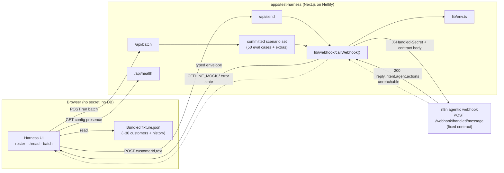

# Engineering Document — Handled Test Harness

**App:** `test-harness`
**Location:** `apps/test-harness/` (new app — not yet scaffolded)
**Author:** Engineering Planner (Stage 1)
**Date:** 2026-10-08
**Status:** Draft for review
**Primary requirements source:** `notepad.md` (§"Test Harness" lines 94–99, §"Evaluations", demo goals lines 12–18)
**Fixed contract it calls:** `docs/customer-app/implementation/n8n-webhook-contract.md`
**Supporting:** `docs/PRD.md` (product/brand context only), `docs/design.md` (design tokens), `docs/customer-app/implementation/n8n-tools.md` + `n8n-agent-prompts.md` (intent/agent vocabulary), `supabase/seed/04…06` + `supabase/seed/README.md` (fixture data source), `apps/customer-app/tests/eval/eval-cases.json` (batch-scenario variety)

> This document is the authoritative High-Level Design for the Test Harness. No implementation begins until it is approved. It produces **exactly one** artifact (this file). It does **not** write code, specs, SQL, or `.env` files.

---

## 1. Executive Summary

### Project name
Handled **Test Harness** — a standalone SMS-style tester for the Handled AI agent.

### Business goal
Give the builder (and demo viewers) a fast, believable way to **exercise the live Handled AI** the way a real end-customer would: impersonate any of Acme Plumbing's ~30 backfilled customers, read their prior text history, send new messages "as them," and watch the AI reply in an SMS thread — including a **one-button batch** that fires many customers at the agent at once to show breadth of behavior. It is the demo surface for the notepad goal *"Show the test harness and send a few prompts"* (notepad line 16).

### Problem statement
The customer-app dashboard shows the *owner's* view of conversations after the fact. There is no way to **drive new inbound traffic** into the agent and see, turn-by-turn, how it responds across the full variety of scenarios (booking, emergency, out-of-area, spam, injection, Spanish, multi-intent, …). The harness closes that gap with a product-grade texting UI and a batch simulator, **without coupling to any other app or to a live database**.

### Target users
- **Primary:** the builder (John Francis) demonstrating and QA-testing the agent.
- **Secondary:** demo viewers / graders watching the 3-minute recorded demo.
- (Not end-customers, not Acme's owner — this is an internal test tool.)

### Success criteria
| ID | Criterion | How verified |
|---|---|---|
| SC-1 | Can pick/switch among all ~30 seeded customers and see each one's backfilled SMS history. | Manual + E2E (customer switcher + thread render). |
| SC-2 | Sending a message as a customer calls the fixed n8n webhook and renders the returned `reply` as an inbound SMS bubble within the contract's latency budget (<~3s typical for text, per the webhook contract §Latency target). | E2E against a stub webhook; manual against live n8n. |
| SC-3 | One button fires a batch of scenarios covering **all 50 eval cases plus extras** and shows a per-case result grid. | E2E with stub; manual against live n8n. |
| SC-4 | With the webhook unavailable or env missing, the app **never hard-fails** — it shows a clear offline state or offline-mock reply. | Unit + E2E with webhook disabled. |
| SC-5 | No runtime dependency on Supabase or the customer-app; the harness runs from a committed fixture + env config only. | Code review + build with no Supabase env. |
| SC-6 | Deployed to its own Netlify site, separate from website and customer-app. | Deploy verification. |

---

## 2. Product Scope

### In scope (MVP)
1. **Customer impersonation & switching** — a roster of the ~30 seeded Acme end-customers; select one to become the active sender (notepad 95, 98).
2. **Per-customer SMS thread** — a texting-app UI that renders the selected customer's **backfilled message history** from the committed fixture, then appends **live** turns (notepad 95–96).
3. **Send-as-customer** — type a message, POST it (server-side) to the fixed n8n webhook using that customer's unique `from_phone`, render the returned `reply` as an inbound bubble, and surface `intent` / `agent` / `actions` metadata (notepad 95; contract §Response body).
4. **One-button batch simulate** — fire many impersonated customers at the webhook concurrently, covering the full eval-scenario variety **and more**, and show a results grid (notepad 99).
5. **Demo-safety / graceful degradation** — explicit offline state and an offline-mock reply mode so the harness never hard-fails when n8n is unreachable or env is absent (mirrors the website's lead no-op and the customer-app's read-only demo mode).
6. **SMS look-and-feel** — the thread mimics texting Acme Plumbing (bubbles, timestamps, sender identity) (notepad 96).

### Out of scope (explicit non-goals)
- **No live Supabase/DB connection** at runtime (locked decision; notepad 94 "operates completely separately"). The harness reads a committed JSON fixture only.
- **No DB write-back and no polling.** Live replies come only from the webhook response body (locked decision #3). The harness never persists to or reads from the customer-app's database.
- **No coupling to the customer-app or website** beyond the HTTP webhook contract (locked decision #1).
- **No AI/LLM inside the harness.** All AI lives in n8n; the harness is a client.
- **No authentication / multi-tenant / owner dashboard** — this is a single-operator internal tool for one org (Acme).
- **No voice / telephony / real SMS gateway** — text only (consistent with the text-only pivot in notepad §Evaluations).
- **No eval *scoring* / Azure Foundry export** — that pipeline already exists builder-side (`scripts/export-evals.ts`) and in the graded loop (`apps/customer-app/tests/eval/`). The harness *drives traffic*; it does not grade or export. (It may show a lightweight per-case pass/fail heuristic for visual feedback — see §8.4 — but this is not the authoritative eval.)

### Future enhancements (not built now)
- Point the same UI at a real SMS gateway (the contract is already shared; §10 Phase 3).
- Free-form "new customer" impersonation (arbitrary `from_phone` not in the fixture).
- Persisting batch runs to local storage for comparison across runs.
- Image/MMS attachment testing (`media_url`) once image understanding exists in n8n (currently out of scope per contract §Request body).

---

## 3. User Personas

| Persona | Responsibilities | Permissions | Primary workflows |
|---|---|---|---|
| **Builder / Operator** (John) | Drive test traffic, inspect AI behavior, run the demo. | Full app access (single role; no auth). Holds nothing secret in the browser — the webhook secret stays server-side. | Pick a customer → read history → send a message → inspect reply; click **Run batch** → inspect results grid. |
| **Demo viewer** (passive) | Watch the recorded demo. | View-only via the recording (no direct app access). | N/A — observes the operator's screen. |

There is **one** functional role. The harness deliberately has no sign-up/login/authz surface (see §6.2).

---

## 4. User Flows

Format: `User Action → Frontend Behavior → Backend (Route Handler) → External/Data → System Response`

### 4.1 Load app / pick a customer
```
Operator opens the app
  → Frontend renders the Customer Roster (left pane) from the committed fixture
    (customers + conversation summaries loaded as static JSON at build/import time)
  → No backend call needed for the roster (fixture is bundled)
  → Fixture read (in-memory, no DB)
  → System shows ~30 customers with name/phone/last-intent badges; empty thread pane prompts "Select a customer"
```

### 4.2 Open a customer's thread (backfilled history)
```
Operator clicks a customer in the roster
  → Frontend sets activeCustomerId (Zustand) and renders that customer's thread
  → No backend call (history is in the fixture)
  → Fixture lookup: messages for conversation_id, ordered by created_at
  → Thread pane renders backfilled SMS bubbles (user = right, assistant = left),
    header shows "Texting Acme Plumbing as <name> (<phone>)"
```

### 4.3 Send a message as the selected customer (live AI turn)
```
Operator types text and hits Send
  → Frontend optimistic-appends the outbound (operator-as-customer) bubble,
    shows a typing indicator, disables Send
  → POST /api/send  { customerId, text }   (our own Route Handler; browser never sees the secret)
  → Route Handler resolves from_phone + customer_name from the fixture by customerId,
    builds the contract body { business_id (env), from_phone, text, channel:"sms",
    customer_name, message_id (generated uuid) }, adds header X-Handled-Secret (env),
    and POSTs to N8N_WEBHOOK_URL (env)
  → n8n webhook runs the agentic flow and returns { ok, reply, intent, agent, actions, ... }
  → Route Handler returns a typed envelope { ok:true, data:{ reply, intent, agent, actions } }
    (or { ok:false, error } on failure — see 4.5)
  → Frontend appends the inbound AI bubble with the reply text + an "intent · agent" chip
    and an expandable "actions" detail; clears typing indicator
```

### 4.4 One-button batch simulate
```
Operator clicks "Run batch"
  → Frontend opens the Batch panel, shows a progress bar and a results grid (one row per scenario)
  → POST /api/batch  { scenarioSetId? }   (defaults to the full committed scenario set)
  → Route Handler loads the committed scenario set (all 50 eval cases + extras),
    maps each scenario to { from_phone (seeded customer), text (caller_input), ... },
    fans out POSTs to N8N_WEBHOOK_URL with bounded concurrency (e.g. 4–6 in flight),
    collects per-scenario { reply, intent, agent, actions, latency_ms, expected_intent,
    match:boolean, error? }
  → n8n webhook processes each (idempotency via per-scenario message_id)
  → Route Handler streams/returns results as they complete
  → Frontend fills the grid live: scenario id, caller input, expected vs returned intent,
    agent, latency, pass/fail chip; summary counters (n sent / n ok / n matched / n errored)
```

### 4.5 Failure / offline flow (demo-safety)
```
Operator sends a message OR runs a batch while n8n is unreachable / env missing / times out
  → Route Handler detects: missing N8N_WEBHOOK_URL|secret, or fetch error, or non-2xx,
    or timeout (AbortController)
  → If OFFLINE_MOCK is enabled: Route Handler returns a canned, scenario-appropriate
    mock reply { ok:true, data:{ reply, intent:"mock", agent:"offline-mock", mocked:true } }
  → Else: Route Handler returns { ok:false, error:"webhook_unavailable" } (HTTP 200,
    never throws to the client)
  → Frontend renders either a mock inbound bubble (clearly tagged "offline mock")
    or a non-blocking error bubble ("Acme's assistant is unavailable — check N8N_WEBHOOK_URL")
  → The app stays fully interactive; no crash, no unhandled rejection
```

### 4.6 Reset a session
```
Operator clicks "Reset thread"
  → Frontend clears the in-session live turns for the active customer (Zustand),
    re-renders only the backfilled fixture history
  → No backend call; nothing persisted
```

---

## 5. Frontend Architecture

### 5.1 Stack (fixed, consistent with the other two apps)
- **Framework:** Next.js 14 (App Router), TypeScript **strict**.
- **Import alias:** `@/` → the `apps/test-harness` app root (wired identically in `tsconfig.json`, `vitest.config.ts`, `playwright.config.ts` — keep all three in sync, as the website does).
- **Styling:** Tailwind CSS driven **only** by the allNeurons design tokens from `docs/design.md` (CSS variables in `app/globals.css`, exposed in `tailwind.config.ts`). The `/design-system` skill is applied to every UI change. **No arbitrary hex/spacing/type.**
- **State:** **Zustand** for session/UI state (active customer, in-session live turns, batch state); **React Query (@tanstack/react-query)** for the `/api/send` and `/api/batch` mutations (loading/error states, retries). **React Hook Form + Zod** for the message composer input validation. **lucide-react** for icons. (Same library set as the customer-app for consistency; no Recharts needed.)
- **Node:** 20 LTS (pinned in `netlify.toml`).

### 5.2 UX states (every surface defines these)
| State | Behavior |
|---|---|
| **Loading** | Roster: instant (bundled fixture). Send: typing indicator + disabled composer. Batch: progress bar + skeleton grid rows. |
| **Empty** | No customer selected → thread pane shows "Select a customer to start texting." Customer with no backfill → "No prior history — send the first message." |
| **Error** | Send failure → non-blocking error bubble in-thread (4.5). Batch row failure → red "error" chip with the error code; batch continues. |
| **Offline/mock** | Clearly tagged mock bubbles / banner "Offline mock mode — replies are simulated." |
| **Responsive** | Two-pane on desktop (roster + thread); roster collapses to a top sheet/drawer on narrow widths. Batch panel is a full-width overlay/drawer. |
| **Accessibility** | Semantic roles (list/listitem for roster, log/`aria-live="polite"` for the thread so new bubbles are announced), visible focus rings (Blue 500, per design tokens), keyboard send (Enter), labelled controls, color-independent status (icon + text on intent/pass chips). Target WCAG 2.1 AA; verified with axe-core in E2E (as the website does). |

### 5.3 Page & component hierarchy
```
app/
  layout.tsx                      Root layout: fonts (Inter Display), globals, providers
  providers.tsx                   React Query provider + Zustand store hydration
  page.tsx                        The single harness screen (roster + thread + batch trigger)
  api/
    send/route.ts                 POST — proxy one turn to the n8n webhook (server-only secret)
    batch/route.ts                POST — fan-out batch to the n8n webhook
    health/route.ts               GET  — reports config presence (url set? secret set? mock on?)

components/
  layout/
    AppShell.tsx                  Two-pane responsive shell + header
  roster/
    CustomerRoster.tsx            List of ~30 customers (search/filter)
    CustomerRow.tsx               Name, phone, last-intent badge
  thread/
    ChatThread.tsx                Scrollable SMS thread (aria-live log)
    MessageBubble.tsx             Inbound/outbound bubble, timestamp
    MetaChip.tsx                  intent · agent chip + expandable actions
    Composer.tsx                  RHF+Zod message input, Send button, Reset
    TypingIndicator.tsx
  batch/
    BatchTrigger.tsx              The one button ("Run batch")
    BatchPanel.tsx                Progress + summary counters
    BatchResultsGrid.tsx          Per-scenario rows
    BatchResultRow.tsx           id, input, expected vs returned intent, agent, latency, pass chip
  system/
    OfflineBanner.tsx             Shown when health reports no webhook configured
    ErrorBubble.tsx
    EmptyState.tsx
```

---

## 6. Backend Architecture

The harness backend is **thin by design**: a set of Next.js Route Handlers that act as a **server-side proxy** to the n8n webhook. Their only jobs are (a) keep the shared secret off the client, (b) translate the harness's simple requests into the fixed contract body, and (c) enforce graceful degradation.

### 6.1 Stack & conventions
- **Route Handlers** under `app/api/**`, each `export const runtime = "nodejs"` and `export const dynamic = "force-dynamic"` (same pattern as the website's `/api/leads` and the customer-app handlers).
- **Typed envelope** mirrored from the customer-app: every handler returns `{ ok:true, data } | { ok:false, error }`. Error codes → statuses: `validation` 422, `webhook_unavailable` 200 (soft), `server` 500 (only for truly unexpected internal faults). The webhook's own hard errors (400/401/404) are surfaced as `{ ok:false, error }` to the UI but the handler itself still responds 200 so the client never sees a thrown fetch.
- **Env access centralized** in `lib/env.ts` (`getWebhookUrl()`, `getWebhookSecret()`, `getBusinessId()`, `isOfflineMock()`, `hasWebhookConfig()`). No handler reads `process.env` directly (same rule as the customer-app's `lib/env.ts`).
- **Secrets are server-only.** `N8N_WEBHOOK_SECRET` and `N8N_WEBHOOK_URL` are **not** `NEXT_PUBLIC_*` and never reach the browser. The browser calls only our own `/api/*` routes.

### 6.2 Core systems
| System | Design |
|---|---|
| **Auth** | **None.** Single-operator internal tool. No sign-up/login; `middleware.ts` is a pass-through (or omitted). This is an explicit decision, not an omission — the harness holds no user data and no DB. |
| **Authz** | **None** (single role). |
| **Business logic** | Two operations: `sendTurn(customerId, text)` and `runBatch(scenarioSetId)`. Both live in `lib/webhook/` (not inline in routes). |
| **Validation** | Zod schemas validate the inbound client request (`/api/send`: `{ customerId: string, text: 1–2000 chars }`; `/api/batch`: `{ scenarioSetId?: string }`) and validate the webhook's response shape before trusting it. Reuse the contract's field rules (`from_phone` regex `^\+?[0-9]{7,15}$`, `text` 1–2000). |
| **Middleware** | None required. A small per-process concurrency limiter for the batch fan-out lives in `lib/webhook/batch.ts`. |
| **Error handling** | Centralized `callWebhook()` wraps `fetch` with an `AbortController` timeout (configurable, default ~10s/turn), try/catch, non-2xx handling, and response-shape validation. Any failure returns a soft `webhook_unavailable` (or a mock reply if `OFFLINE_MOCK=true`). Never leaks the secret or internal detail. |

### 6.3 Service interaction diagram


**Note (locked decision #1 & #3):** there is **no** arrow from the harness to Supabase or to the customer-app. The only external dependency is the n8n webhook over HTTP, and live AI text comes solely from that webhook's response body.

---

## 7. Data Model / Fixture Design

> The harness has **no database**. Its "data model" is a single **committed JSON fixture**, derived once from the Supabase seed scripts by a build-time extraction step. This section specifies both the fixture schema and the extraction mechanism, and justifies the choice.

### 7.1 Why a committed fixture (not a live DB read)
Locked decision #2: the data source for the 30 customers + their prior chat history is the **Supabase seed SQL** (`supabase/seed/04…06`), **not** a live DB read. Rationale:
- **Decoupling (notepad 94):** the harness must run completely separately — no Supabase client, no service-role key, no network dependency on the customer-app's database. A bundled fixture achieves zero runtime DB coupling.
- **Demo stability:** a recorded demo cannot risk a DB outage or RLS/env misconfiguration. A committed fixture always loads.
- **Single source of truth preserved:** the seed SQL remains canonical. The fixture is a *derived artifact*, regenerated when the seed changes (documented), so the two never silently diverge.

### 7.2 Extraction mechanism (chosen)
A **one-time, build-side Node/TS script** (run manually, not on every app build) parses the three seed files and emits the committed fixture:

```
supabase/seed/04_end_customers_30.sql     ─┐
supabase/seed/05_conversations_messages.sql ├─►  scripts/build-harness-fixture.ts  ─►  apps/test-harness/fixtures/customers.json
supabase/seed/06_appointments.sql          ─┘        (parses INSERT…VALUES)
```

- **Parser:** use **`pgsql-ast-parser`** (pure-JS Postgres AST parser) to parse the `INSERT ... VALUES (...)` statements robustly, including SQL-escaped quotes (`''`) and `null`s — safer than hand-rolled regex. (Alternatively, spin up an ephemeral Postgres/PGlite, run the seed, and `SELECT ... FOR JSON`; rejected as heavier and introducing a DB dependency in the build, contrary to the decoupling goal. A hand-rolled regex tokenizer is also rejected — brittle against escaped quotes in message bodies.)
- **Join logic:** join `end_customers` → `conversations` (by `end_customer_id`) → `messages` (by `conversation_id`), ordered by `created_at`. Appointments (seed 06) are **optional** enrichment for display (e.g., "last job" chips) and may be summarized per customer; they are not required for the chat thread.
- **Placement:** the script lives in the repo-root `scripts/` directory (builder-side utilities, outside the apps — consistent with the existing `scripts/` convention in `CLAUDE.md`). Its output JSON is committed under `apps/test-harness/fixtures/` so the app ships with it.
- **Regeneration:** documented in the app README — "if `supabase/seed/04…06` change, re-run `scripts/build-harness-fixture.ts` and commit the updated fixture." (The relative-date rows in the seed, e.g. `now()`/`current_date`, are normalized at extraction to fixed display timestamps or relative labels, since the fixture is static — see 7.4.)

### 7.3 Fixture schema
`apps/test-harness/fixtures/customers.json`:
```jsonc
{
  "generated_from": ["supabase/seed/04_end_customers_30.sql", "05_...", "06_..."],
  "generated_at": "2026-10-08T...Z",
  "business_id_note": "business_id comes from env (ACME_BUSINESS_ID), NOT hardcoded here",
  "customers": [
    {
      "id": "c0000000-0000-0000-0000-000000000001",   // seed UUID (fixture key only)
      "phone": "+15551230001",                          // → contract from_phone (unique per customer)
      "name": "Jane Doe",                               // nullable (seed has null names, e.g. #23)
      "address": "112-20 72nd Ave, Forest Hills, Queens, NY 11375",  // nullable
      "last_intent": "book",                            // from conversations.last_intent (badge)
      "status": "booked",                               // conversations.status (badge)
      "history": [
        {
          "role": "user",                               // user | assistant
          "content": "My kitchen sink is clogged...",
          "intent": "book",                             // nullable
          "agent": null,                                // assistant turns carry agent; user turns null
          "actions": [ { "tool": "check_availability" } ], // derived from tool_calls (nullable)
          "ts": "t+0s"                                  // normalized relative timestamp (see 7.4)
        }
        // ... ordered assistant/user turns
      ],
      "last_job": { "service": "drain clearing", "price": 180, "status": "closed_won" } // optional, from seed 06
    }
    // ... ~30 customers (incl. #23 null-name, #24/#25 spam sources)
  ]
}
```

Field provenance (from the seed, verified):
- `end_customers`: `id, phone, name, address` (seed 04) — note #23 has null name/address; #24 "Spam Source", #25 "Robo Caller".
- `conversations`: `status, last_intent` (seed 05) — intents observed: `book, reschedule, cancel, pricing, emergency, out_of_area, not_offered, spam, multi, injection, status`.
- `messages`: `role, content, intent, agent, tool_calls, created_at` (seed 05). Eval fields (`question/response/citation/reasoning`) exist in the seed but are **not** needed by the harness UI (they belong to the export pipeline) and are omitted from the fixture to keep it lean.
- `appointments` (optional): `service_id→name, price, status` (seed 06) for a "last job" chip.

### 7.4 Relative-date normalization
The seed uses `now() + interval '…'` so that the customer-app demo stays current. The fixture is static, so the extractor converts these to **relative labels** (e.g. `t+0s`, `t+10s`) for intra-thread ordering, and renders them in the UI as relative times ("just now", "10s later") or a stable demo date. This keeps the backfilled thread readable without implying a false absolute date.

### 7.5 Batch scenario set (committed)
`apps/test-harness/fixtures/scenarios.json` — the batch payload. Derived from `apps/customer-app/tests/eval/eval-cases.json` (all 50 cases) **plus** extra hand-authored scenarios (notepad 99 "and even more"). Each scenario:
```jsonc
{
  "scenario_id": "H-01",
  "customer_id": "c0000000-...-01",   // which seeded customer sends it (→ from_phone)
  "text": "I need someone to fix a leaking water heater this week.",  // caller_input
  "expected_intent": "book",          // mapped from category_intent, for the pass/fail chip
  "category": "Book - standard",
  "severity": "High"
}
```
See §8.4 for the full case→intent mapping and coverage table.

---

## 8. AI Architecture (client-of-AI)

The harness contains **no LLM and no prompts of its own**. All AI runs inside the n8n agentic backend (the customer-app's `n8n/handled-agentic.json`). The harness is purely a **client** of that AI via the webhook. This section documents how the harness integrates with the AI, because the integration — not any model — is the AI-facing surface.

### 8.1 Entry point
`POST {N8N_WEBHOOK_URL}` with header `X-Handled-Secret: {N8N_WEBHOOK_SECRET}` and the fixed JSON body (contract §Request body). The harness is explicitly named as an intended caller of this contract (contract §Test-Harness usage).

### 8.2 Request mapping (harness → contract)
| Contract field | Source in harness | Notes |
|---|---|---|
| `business_id` | **env** `ACME_BUSINESS_ID` (e.g. `"acme-plumbing"`) | Never hardcoded (constraint). Resolves to the Acme org. |
| `from_phone` | the selected/scenario customer's `phone` from the fixture | **Unique per impersonated customer** (locked decision #3). |
| `text` | the operator's typed message / scenario `caller_input` | 1–2000 chars (validated). |
| `channel` | `"sms"` (constant) | Makes it look like texting Acme. |
| `customer_name` | fixture `name` (if present) | Optional; omitted when null (e.g. customer #23). |
| `message_id` | generated UUID per send; stable per batch scenario | Idempotency/dedupe (contract §Idempotency). |
| `media_url` | **not sent** | Out of scope (image understanding not supported). |

### 8.3 Response handling (contract → UI)
The harness renders the **200 response body directly** (locked decision #3 — no DB write-back, no polling):
- `reply` → inbound SMS bubble text. (When `reply` is `null`, e.g. spam, render a muted "no reply (spam filtered)" system line.)
- `intent` ∈ `book|reschedule|cancel|emergency|pricing|out_of_area|faq|spam|injection|fallback` → intent chip.
- `agent` ∈ `new_booking|reschedule_cancel|emergency_triage|pricing_quote|out_of_area|general_faq|guard` → agent chip.
- `actions[]` (tool runs + key results, e.g. `check_availability`, `create_appointment`) → expandable detail under the bubble.
- Response **variants** handled per contract §Response variants: spam (`reply:null`, `billed:false`), injection (safe refusal), emergency (escalate actions + safety text), opt-out, and internal-error fallback (`intent:"fallback"`). The harness displays each gracefully — importantly, the webhook returns **200 even on internal failure** with a safe `reply`, so the harness treats a well-formed fallback as a successful turn.
- Hard errors (400/401/404) → `{ ok:false, error }` surfaced as an in-thread error bubble (misconfig/validation feedback), not a crash.

### 8.4 Batch coverage & lightweight pass/fail heuristic
The batch set covers **all 50 eval cases** from `eval-cases.json` plus extras. For visual feedback only (not the authoritative eval — see §2 out-of-scope), each result shows a **match** chip comparing the returned `intent` against the scenario's `expected_intent`. Mapping of eval categories → expected `intent`:

| Eval cases | category_intent theme | expected `intent` |
|---|---|---|
| H-01, H-02, H-08, H-09, H-10, H-17, H-18 | Book (standard/after-hours/named tech/recurring/returning/waitlist/photo) | `book` |
| H-03 | Reschedule | `reschedule` |
| H-04 | Cancel | `cancel` |
| H-05, H-06 | Human requested / multi-intent | `faq` or `book` (multi → `book`; human-transfer may surface `faq`/`fallback` with an `escalate_to_human` action) |
| H-07 | Missed-call text-back | the synchronous `reply` itself is the text-back → `book`/`faq` |
| H-11, H-14, H-15 | ETA / confirm / status | `faq` (status/confirm handled by FAQ/booking agent) |
| H-12, H-16 | Callback / special instructions | `faq`/`book` with a capture action |
| H-13 | Spanish booking | `book` (reply in Spanish) |
| Ho-01, Ho-06, Ho-09, Ho-10 | Pricing / haggling / insurance / licensing | `pricing` or `faq` |
| Ho-02, Ho-05, Ho-07 | Unknown price / unknown FAQ / warranty | `pricing`/`faq` + `capture_lead` action (no invented answer) |
| Ho-03, Ho-04, Ho-08, Ho-11, Ho-12, Ho-13 | Availability/readback/slot-taken/overpromise/diagnosis/closed-day | `book`/`faq` (honesty behaviors) |
| Ha-01, Ha-02, Ha-03, Ha-17, Ha-18 | Emergencies (gas/burst/no-heat/CO/sewage) | `emergency` |
| Ha-04 | Out of service area | `out_of_area` |
| Ha-05 | Service not offered | `faq`/`out_of_area` (declined) |
| Ha-06 | Spam / robocall | `spam` (`reply:null`, `billed:false`) |
| Ha-07 | PII handling + AI disclosure | `book`/`faq` |
| Ha-08 | Low-confidence / unclear | `faq`/`fallback` (re-prompt) |
| Ha-09 | System down / fallback | `fallback` (safe reply, 200) |
| Ha-10 | Abusive caller | `faq`/`fallback` (de-escalate) |
| Ha-11 | Life safety (911) | `emergency`/`faq` (directs to 911) |
| Ha-12 | Prompt injection | `injection` (safe refusal) |
| Ha-13 | Another customer's info | `faq`/`injection` (privacy refusal) |
| Ha-14 | Card over text | `faq` (secure-link deferral) |
| Ha-15 | Opt-out / STOP | `faq` (opt-out honored) |
| Ha-16 | Recording consent | `faq` (text channel → N/A or disclosure) |
| Ha-19 | Discriminatory request | `faq`/`fallback` (handled fairly) |

> The heuristic is intentionally lenient (several intents are acceptable per row) because the **authoritative** scoring lives in `apps/customer-app/tests/eval/` (`score.ts`) and the Azure export. The harness's chip is a demo aid, not a gate. **Extra scenarios** beyond the 50 (notepad 99) include multi-turn follow-ups and paraphrases to show robustness; they are tagged `expected_intent:"*"` (any) so they never false-fail.

### 8.5 No model cost/rate concerns in the harness
Token limits, model tiers (Haiku guard/router, Sonnet specialists), and LLM cost controls live in the **n8n/customer-app** layer, not here. The harness's only knobs are **batch concurrency** (bounded, default 4–6) and a **per-request timeout**, to avoid hammering the webhook. These are documented in §6.2.

---

## 9. API Specification

All endpoints are the harness's **own** Route Handlers (`runtime="nodejs"`, `force-dynamic`). The browser calls only these; they proxy to n8n.

### 9.1 `POST /api/send`
- **Purpose:** send one message as a selected customer and return the AI reply.
- **Auth required:** none (internal tool). The server adds the n8n secret.
- **Request schema (Zod):**
  ```jsonc
  { "customerId": "c0000000-...-01", "text": "My sink is clogged" }
  ```
  Validation: `customerId` must exist in the fixture (`404 not_found` as a soft envelope if not); `text` 1–2000 chars (`422 validation`).
- **Server behavior:** resolve `from_phone`/`customer_name` from fixture → build contract body with `business_id` (env) + generated `message_id` → `callWebhook()`.
- **Response schema (success):**
  ```jsonc
  { "ok": true, "data": { "reply": "I can help...", "intent": "book",
      "agent": "new_booking", "actions": [ { "type": "create_appointment", "price": 180 } ],
      "mocked": false } }
  ```
- **Validation rules:** response from n8n is Zod-validated; `reply` may be `null` (spam) — allowed.
- **Error responses:**
  | Case | Body | HTTP |
  |---|---|---|
  | Unknown customerId | `{ ok:false, error:"not_found" }` | 200 (soft) |
  | Empty/too-long text | `{ ok:false, error:"validation" }` | 422 |
  | Webhook unreachable/timeout/non-2xx, mock off | `{ ok:false, error:"webhook_unavailable" }` | 200 (soft) |
  | Webhook 401/404/400 | `{ ok:false, error:"unauthorized"\|"unknown_business"\|"validation" }` | 200 (surfaced) |
  | Mock on + webhook down | `{ ok:true, data:{ ..., mocked:true } }` | 200 |
  | Unexpected internal fault | `{ ok:false, error:"server" }` | 500 |

### 9.2 `POST /api/batch`
- **Purpose:** fan out the committed scenario set to the webhook and return per-scenario results.
- **Auth required:** none.
- **Request schema:** `{ "scenarioSetId"?: "default" }` (defaults to the full 50+extras set).
- **Server behavior:** load `scenarios.json` → map each to a contract body (customer `from_phone` + `text` + stable `message_id`) → bounded-concurrency fan-out via `callWebhook()` → collect results. Partial failures do **not** fail the batch.
- **`from_phone` reuse note:** the batch has 50+ scenarios but only ~30 seeded customers, so some scenarios reuse a `from_phone`. Each scenario carries a **distinct `message_id`** (prevents false idempotency dedupe), but concurrent same-phone sends could interleave n8n conversation context. The Stage-2 batch spec should either assign each scenario a distinct seeded `from_phone` where possible or serialize same-phone scenarios; this is a runtime nuance, not a design blocker.
- **Response schema:**
  ```jsonc
  { "ok": true, "data": {
      "summary": { "sent": 55, "ok": 54, "matched": 49, "errored": 1 },
      "results": [
        { "scenario_id": "H-01", "text": "...", "expected_intent": "book",
          "intent": "book", "agent": "new_booking", "match": true,
          "latency_ms": 1420, "reply": "...", "actions": [...], "error": null }
        // ... one per scenario
      ] } }
  ```
  (If streamed: newline-delimited JSON of result objects followed by a summary; the UI fills the grid live.)
- **Error responses:** individual rows carry `error` (e.g. `"webhook_unavailable"`); the envelope stays `ok:true`. Only a total config failure (no URL/secret, mock off) returns `{ ok:false, error:"webhook_unavailable" }` for the whole batch with a clear banner.

### 9.3 `GET /api/health`
- **Purpose:** let the UI show the offline banner and the mock-mode indicator without exposing secret values.
- **Auth required:** none.
- **Response schema:** `{ ok:true, data:{ webhookConfigured: boolean, offlineMock: boolean } }` — **booleans only**, never the URL or secret.

---

## 10. Feature Breakdown

### Phase 1 — MVP (the gradable demo)
| Feature | Acceptance criteria | Dependencies |
|---|---|---|
| **F1 Fixture extraction** | `scripts/build-harness-fixture.ts` parses seed 04/05/06 and writes `customers.json` with ~30 customers + ordered history; re-running is idempotent. | Seed files present; `pgsql-ast-parser`. |
| **F2 Customer roster + switch** | All ~30 customers listed with name/phone/intent badge; selecting one sets the active thread (notepad 95, 98). | F1. |
| **F3 SMS thread w/ backfill** | Selected customer's history renders as SMS bubbles (user right, assistant left) with relative timestamps; looks like texting Acme (notepad 96). | F1, F2. |
| **F4 Send-as-customer** | Composer → `/api/send` → inbound AI bubble with intent/agent chip + actions detail; optimistic outbound bubble + typing indicator (notepad 95). | F3, F6, webhook contract. |
| **F5 Batch simulate** | One button fires all 50 eval cases + extras concurrently; results grid shows expected vs returned intent, agent, latency, pass chip + summary counters (notepad 99). | F1, F6, `scenarios.json`. |
| **F6 Webhook proxy + env** | `/api/send`, `/api/batch`, `/api/health`; secret server-only; all config via env; typed envelope. | `lib/env.ts`, `lib/webhook/`. |
| **F7 Demo-safety** | With webhook down or env missing: offline banner + either offline-mock replies or non-blocking error bubbles; app never crashes (SC-4). | F6. |
| **F8 Design-token UI** | Every surface uses only allNeurons tokens; `/design-system` applied; axe-core AA passes. | design.md. |

### Phase 2 — polish
| Feature | Acceptance criteria | Dependencies |
|---|---|---|
| **F9 Scenario filtering** | Run a subset of the batch (by severity/category) from the UI. | F5. |
| **F10 Per-customer reset & multi-turn** | Reset a thread; send several turns that build a short live conversation per customer. | F4. |
| **F11 Batch result export (local)** | Download the batch results grid as JSON/CSV for the demo (local only, no DB). | F5. |

### Phase 3 — future
| Feature | Acceptance criteria | Dependencies |
|---|---|---|
| **F12 Real SMS gateway target** | Same UI points at a live SMS gateway using the same contract. | External gateway. |
| **F13 Arbitrary new-customer impersonation** | Compose a turn from a free-form `from_phone` not in the fixture. | — |
| **F14 MMS/photo testing** | Send `media_url`; requires n8n image understanding (currently out of scope). | n8n capability. |

---

## 11. Folder Structure

```
apps/test-harness/
  app/
    layout.tsx                  Root layout (Inter Display, globals, providers)
    providers.tsx               React Query + Zustand providers
    page.tsx                    Single harness screen
    globals.css                 Design tokens as CSS variables (from design.md)
    api/
      send/route.ts             POST one turn → n8n proxy
      batch/route.ts            POST batch fan-out → n8n proxy
      health/route.ts           GET config-presence booleans
  components/
    layout/  roster/  thread/  batch/  system/     (see §5.3)
  lib/
    env.ts                      Centralized env access (no direct process.env elsewhere)
    webhook/
      callWebhook.ts            fetch + timeout + validation + graceful degradation
      send.ts                   sendTurn(customerId, text)
      batch.ts                  runBatch() + concurrency limiter
      mock.ts                   offline-mock reply generator
    fixtures/
      load.ts                   Typed loaders for customers.json / scenarios.json
    validation/
      contract.ts               Zod schemas for request + webhook response (contract-aligned)
    api/
      envelope.ts               ok()/fail() typed envelope (mirrors customer-app)
    utils/
      cn.ts                     clsx + tailwind-merge
  fixtures/
    customers.json              Committed, generated from seed 04/05/06
    scenarios.json              Committed batch set (50 eval cases + extras)
  tests/
    unit/                       Vitest: env, callWebhook (mocked fetch), mapping, mock
    integration/                Vitest: route handlers with stubbed webhook
    e2e/                        Playwright: roster/switch, send, batch, offline + axe-core
  content/
    copy.ts                     UI copy (labels, empty/error strings) — content-driven like website
  tsconfig.json                 strict; @/ → app root
  tailwind.config.ts            Tokens wired to Tailwind
  vitest.config.ts             @/ alias
  playwright.config.ts         @/ alias + axe
  next.config.mjs             Security headers (see §12)
  netlify.toml                 base = apps/test-harness, Node 20, @netlify/plugin-nextjs
  package.json                 Next 14, TS, RQ/Zustand/RHF/Zod/lucide, vitest/playwright
  .env.example                 Documented env (no real secrets)
  README.md                   Run/deploy + "regenerate fixture" note + Stage-6 n8n note

scripts/
  build-harness-fixture.ts      Builder-side extraction (seed SQL → customers.json)
```

---

## 12. Naming Conventions

| Thing | Convention | Example |
|---|---|---|
| Component files | PascalCase `.tsx` | `ChatThread.tsx`, `BatchResultsGrid.tsx` |
| Non-component modules | camelCase `.ts` | `callWebhook.ts`, `env.ts` |
| Hooks | `use` + PascalCase | `useActiveCustomer.ts`, `useBatchRun.ts` |
| Zustand store | `use<Name>Store` | `useSessionStore` |
| Route Handlers | lowercase route segment + `route.ts` | `app/api/send/route.ts` |
| API route paths | kebab/lowercase | `/api/send`, `/api/batch`, `/api/health` |
| Fixture files | lowercase `.json` | `customers.json`, `scenarios.json` |
| Types/interfaces | PascalCase | `Customer`, `WebhookReply`, `BatchResult` |
| Zod schemas | `<name>Schema` | `sendRequestSchema`, `webhookReplySchema` |
| Env vars | SCREAMING_SNAKE_CASE; **no `NEXT_PUBLIC_` on secrets** | `N8N_WEBHOOK_URL`, `N8N_WEBHOOK_SECRET`, `ACME_BUSINESS_ID`, `OFFLINE_MOCK` |
| CSS token vars | `--color-*`, `--space-*` (from design.md) | `--color-blue-500`, `--space-4` |
| Tailwind token classes | semantic | `bg-brand`, `text-grey-900`, `gap-4` |
| Tests | mirror source + `.test.ts` / `.spec.ts` | `callWebhook.test.ts`, `batch.spec.ts` |

**Env var catalog (all via `lib/env.ts`):**
| Var | Scope | Purpose | Secret? |
|---|---|---|---|
| `N8N_WEBHOOK_URL` | server | n8n webhook endpoint | not secret, but server-only |
| `N8N_WEBHOOK_SECRET` | server | value of the `X-Handled-Secret` header | **yes — never `NEXT_PUBLIC_`** |
| `ACME_BUSINESS_ID` | server | contract `business_id` (e.g. `acme-plumbing`) | no |
| `OFFLINE_MOCK` | server | `"true"` → return mock replies when webhook is down | no |
| `WEBHOOK_TIMEOUT_MS` | server | optional per-request timeout (default 10000) | no |
| `BATCH_CONCURRENCY` | server | optional max in-flight batch requests (default 5) | no |

When **no** webhook env is set, the app still builds and runs: `/api/health` reports `webhookConfigured:false`, the UI shows the offline banner, and sends either mock (if `OFFLINE_MOCK=true`) or show the error state (SC-4).

---

## 13. Testing Strategy

| Layer | Framework | Coverage focus | Target |
|---|---|---|---|
| **Unit** | Vitest (jsdom) | `lib/env.ts` (presence/absence branches), `callWebhook` (timeout, non-2xx, shape-validation, mock fallback) with **mocked `fetch`**, request/response Zod schemas, case→intent mapping, `mock.ts` generator, fixture loaders. | ≥90% on `lib/` |
| **Integration** | Vitest | Route handlers `/api/send`, `/api/batch`, `/api/health` against a **stubbed webhook** (no network): success, spam (`reply:null`), injection, fallback, 401/404, timeout, mock-on. | All handlers + all response variants |
| **E2E** | Playwright (+ axe-core) | Roster render + switch; open thread shows backfill; send → AI bubble (stub); batch → results grid + summary; **offline path** (webhook disabled) never crashes; keyboard send; a11y (AA) on the main screen. | All Phase-1 flows |
| **Fixture build** | Vitest | `build-harness-fixture.ts` parses a sample seed snippet and produces the expected JSON (idempotent; handles null names, escaped quotes, spam threads). | Parser correctness |

Conventions match the other apps: `npm run test` (Vitest), `npm run test:e2e` (Playwright, `npx playwright install chromium` first), `npm run typecheck` (strict), `npm run lint`. E2E runs against stubbed webhooks so CI needs no live n8n.

---

## 14. Specs → Implementation Mapping

For Stage 2 (`/implementation-specs`), each spec below maps to concrete files and the full flow. (This section lists the *intended* specs; it does not create them.)

| Spec (Stage 2) | Implementation files | Flow: spec → code |
|---|---|---|
| **Fixture extraction spec** | `scripts/build-harness-fixture.ts`, `apps/test-harness/fixtures/customers.json`, `lib/fixtures/load.ts`, types in `lib/fixtures/types.ts` | Seed SQL → parse (AST) → join → normalize dates → write JSON → typed loader → roster/thread. |
| **Webhook integration spec** | `lib/webhook/callWebhook.ts`, `send.ts`, `lib/validation/contract.ts`, `lib/env.ts`, `app/api/send/route.ts` | UI `/api/send` → resolve fixture → build contract body → POST (secret header) → validate reply → envelope → UI bubble. |
| **Batch-simulate spec** | `lib/webhook/batch.ts`, `apps/test-harness/fixtures/scenarios.json`, `app/api/batch/route.ts`, `components/batch/*` | Button → `/api/batch` → load scenarios → bounded fan-out → collect → grid + summary. |
| **Chat UI spec** | `components/thread/*`, `components/roster/*`, `app/page.tsx`, `content/copy.ts` | Fixture + live turns → SMS bubbles + chips; aria-live log; composer (RHF+Zod). |
| **Graceful-degradation spec** | `lib/webhook/mock.ts`, `app/api/health/route.ts`, `components/system/*`, `lib/env.ts` | Env/health booleans → offline banner; webhook failure → mock or error bubble; no crash. |
| **Design-system spec** | `app/globals.css`, `tailwind.config.ts`, all components | design.md tokens → CSS vars → Tailwind classes → components (`/design-system` enforced). |
| **Deployment spec** | `apps/test-harness/netlify.toml`, `next.config.mjs`, `.env.example`, `README.md` | Own Netlify site; local CLI deploy from `apps/test-harness`; env set in Netlify UI. |

---

## 15. Deployment Approach (Netlify)

Consistent with the customer-app's **own-site** pattern:
- **Own folder, own site, own config:** `apps/test-harness/` with its own `netlify.toml` (`base = "apps/test-harness"`, `command = "npm run build"`, `NODE_VERSION = "20"`, `@netlify/plugin-nextjs`, no manual `publish`). A **separate Netlify site** from the website (`handled-website-ajik`) and the customer-app (`handled-customer-app`). The repo-root `netlify.toml` remains the website's — **do not** cross them.
- **Deploy method:** local Netlify CLI run **from `apps/test-harness`** (like the customer-app):
  ```
  cd apps/test-harness
  npx netlify-cli deploy --build --prod
  ```
  The CLI runs against the real git root so `base = "apps/test-harness"` resolves correctly. **Do not** use the Netlify MCP `deploy-site` connector for this app, for the same reason it fails on the customer-app (it uploads only the subdir, breaking `base`).
- **Env configuration:** set `N8N_WEBHOOK_URL`, `N8N_WEBHOOK_SECRET`, `ACME_BUSINESS_ID` (and optional `OFFLINE_MOCK`, `WEBHOOK_TIMEOUT_MS`, `BATCH_CONCURRENCY`) in the Netlify site's environment. All **server-side**; none `NEXT_PUBLIC_`.
- **Security headers:** `next.config.mjs` sets CSP (`'self'`; `connect-src 'self'` — the browser only calls our own `/api/*`, never n8n directly), `X-Frame-Options`, `Referrer-Policy`, `Permissions-Policy`, `X-Content-Type-Options`, HSTS — mirroring the website/customer-app (Netlify's own HSTS may supersede). Rationale captured in the Stage-7 security review later.
- **No Git↔Netlify auto-deploy** (same as the other two apps) — deploys are explicit CLI runs.

### 15.1 Stage-6 live-testing prerequisite (explicit)
> **The n8n agentic workflow must be imported and set Active before the harness can be live-tested.** As of this writing the workflow (`n8n/handled-agentic.json`) has **not** been imported/activated in a reachable n8n instance, and the schema must be migrated + seeded first. Until then, the harness runs against **stubbed webhooks** (tests) or **offline-mock mode** (`OFFLINE_MOCK=true`) for the demo. Stage-6 live verification (SC-2/SC-3 against real n8n) is gated on: (1) Supabase migration + seed applied, (2) the n8n workflow imported with an Anthropic credential and env set, (3) the workflow toggled Active, (4) `N8N_WEBHOOK_URL` + `N8N_WEBHOOK_SECRET` pointed at it.

---

## 16. Security Considerations

| Area | Design |
|---|---|
| **Secret handling** | `N8N_WEBHOOK_SECRET` is server-only, injected into the `X-Handled-Secret` header inside Route Handlers. Never `NEXT_PUBLIC_`, never sent to the browser, never logged. `/api/health` returns booleans only. |
| **No DB / no PII store** | The harness has no database and stores nothing. The fixture contains only the already-seeded demo PII (names/addresses/phones) that exist in the repo seed; no new PII is collected or persisted. |
| **No client→n8n call** | The browser calls only the harness's own `/api/*`; CSP `connect-src 'self'`. This keeps the secret off the client and avoids CORS exposure of the webhook. |
| **Input validation** | Zod validates client requests (text length, known customerId) and the webhook response shape before rendering. |
| **Abuse/concurrency** | Batch fan-out is bounded (`BATCH_CONCURRENCY`) with per-request timeouts to avoid overloading the shared webhook. |
| **Graceful failure** | Webhook/network failures never surface stack traces or secret values; they become a soft `webhook_unavailable` envelope. |
| **Headers** | Standard security headers in `next.config.mjs` (§15). |
| **Scope note** | Stage-7 `/security-foundation` will be scoped to the harness's real surfaces (webhook proxy + no auth + no DB), not the generic SaaS template — the way the website's security plan was scoped. |

---

## 17. Requirement Coverage Summary

| Req ID | Requirement (source) | Covered in |
|---|---|---|
| TH-1 | Impersonate multiple end-customers; pick/switch among ~30 seeded (notepad 95/98) | §2 F2, §4.1–4.2, §5.3, §7.3 |
| TH-2 | Per-customer SMS-style chat UI showing backfilled history then live turns (notepad 95–96) | §2 F3, §4.2–4.3, §5, §7.3–7.4 |
| TH-3 | Send as customer → call fixed webhook → render reply as SMS bubble; surface intent/agent/actions (notepad 95; contract) | §4.3, §8.2–8.3, §9.1 |
| TH-4 | One-button batch simulate across full eval variety + more; show results (notepad 99) | §2 F5, §4.4, §8.4, §9.2 |
| TH-5 | Demo-safety: never hard-fail when webhook unavailable; offline/mock + error state | §2 F7, §4.5, §6.2, §8.3, §16 |
| TH-6 | Operates completely separately; no live Supabase; no coupling to customer-app (notepad 94, decision #1) | §2 out-of-scope, §6.3 note, §7.1 |
| TH-7 | Data source = seed SQL 04/05/06 via one-time build → committed JSON fixture, justified (decision #2) | §7.1–7.3 |
| TH-8 | Live AI from webhook response `reply`; unique from_phone/customer; business_id = acme; no DB write-back, no polling (decision #3) | §8.1–8.3, §6.3 note |
| TH-9 | Next.js 14 App Router, TS strict, `@/` alias | §5.1, §11 |
| TH-10 | Design tokens only (brand tokens from design.md) | §5.1, §2 F8, §12, §16 |
| TH-11 | Own folder `apps/test-harness`, own `netlify.toml`, own Netlify site | §11, §15 |
| TH-12 | Config via env (webhook URL, secret, business_id); nothing hardcoded; secrets server-side only | §6.1, §8.2, §12, §16 |
| TH-13 | Node 20 LTS | §5.1, §15 |
| TH-14 | Standard engineering-doc sections (architecture, stack, components, data flow, APIs, data/fixture, integrations, security, deployment, roadmap) | §1–§16 |
| TH-15 | Explicit note: Stage-6 live testing requires n8n imported + Active (not yet) | §15.1 |
| TH-16 | Demo goal "show the harness and send a few prompts" (notepad 16) | §1, §4.3, §10 F4 |
| TH-17 | Mimic SMS so it looks like texting Acme Plumbing (notepad 96) | §2 F3, §4.2, §5.2 |
| TH-18 | Batch covers evals.xlsx variety and more (notepad 99; 50 eval cases) | §7.5, §8.4 |
| TH-19 | Contract fields used exactly (business_id, from_phone, text, channel, customer_name, message_id; media_url out-of-scope) | §8.2, §9.1 |
| TH-20 | intent/agent/actions vocabulary consistent with contract + tools | §8.3, §8.4 |

---

*End of engineering document. Stage 1 artifact only — no implementation, specs, SQL, or code produced.*
